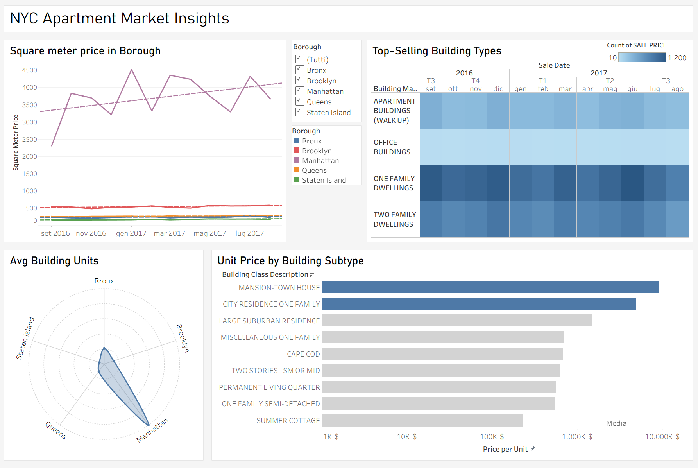
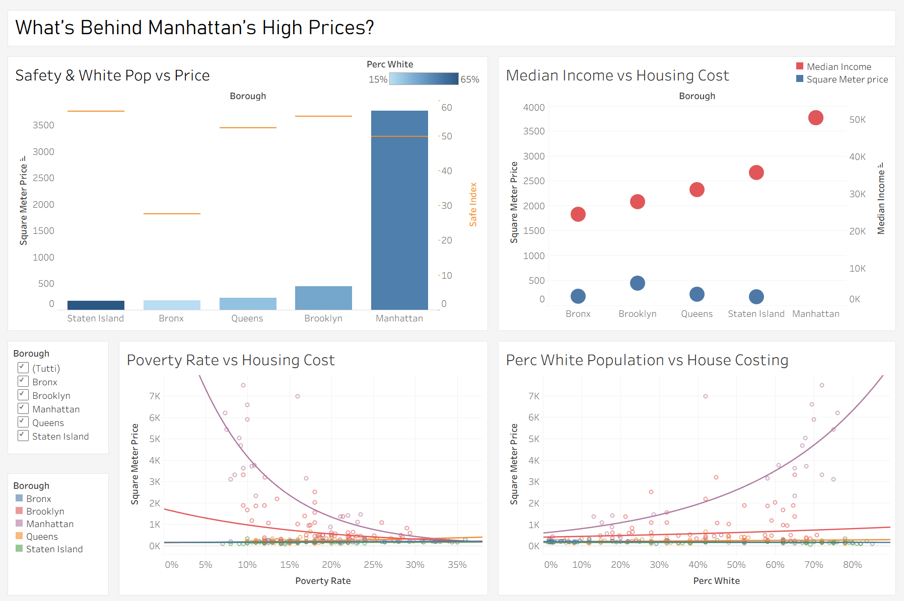

# NYC Real Estate Data Warehouse Project

This project implements a Data Warehouse (DW) solution for New York City real estate and neighborhood financial data. It covers data preprocessing, schema reengineering, database creation, and population of both reconciled and data warehouse schemas, including a star schema for analytical purposes.

## 📁 Repository Structure
```plaintext
├── scriptSQL/
│   ├── createReconcilied.sql # Creates the reconciled schema based on logical schema reengineering
│   ├── populateReconcilied.sql # Populates the reconciled schema with cleaned and integrated data
│   ├── createDW.sql # Creates the star schema for the Data Warehouse
│   └── populateDW.sql # Populates the Data Warehouse with data from the reconciled schema
├── preprocess_dataset.py # Cleans and integrates the NYC property sales dataset
├── preprocess_dataset_indici.py # Cleans and integrates the Neighborhood Financial Health Indication dataset and merges it with the NYC dataset
└── preprocess_summary_table.py # Performs data quality analysis and generates summary tables
```
## 📌 Project Description

### 1. Preprocessing Phase
- `preprocess_dataset.py`: Cleans and integrates the **NYC property sales** dataset.
- `preprocess_dataset_indici.py`: Cleans and integrates the **Neighborhood Financial Health Indication** dataset and merges it with the NYC dataset.
- `preprocess_summary_table.py`: Performs **data quality analysis** and generates summary tables.

### 2. Database Schema and Population
- `createReconcilied.sql`: Creates the **reconciled schema**, based on the reengineered logical model.
- `populateReconcilied.sql`: Populates the reconciled schema with cleaned, integrated data.
- `createDW.sql`: Creates the **star schema** for the Data Warehouse.
- `populateDW.sql`: Loads data from the reconciled schema into the Data Warehouse.

## 📊 Dashboards


